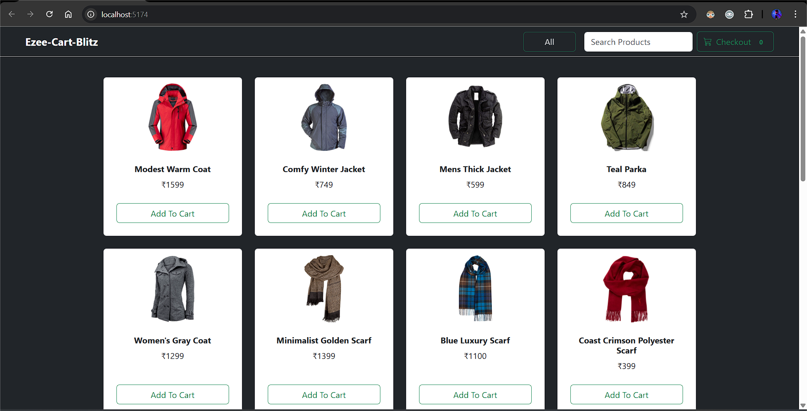
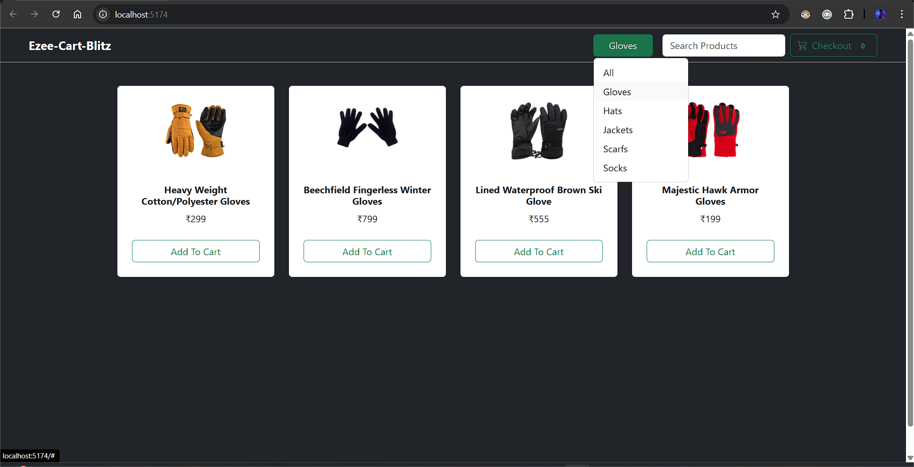
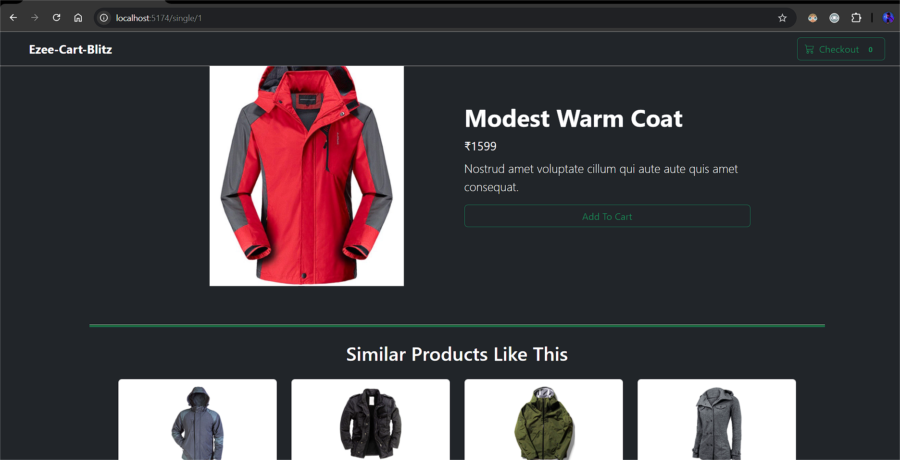
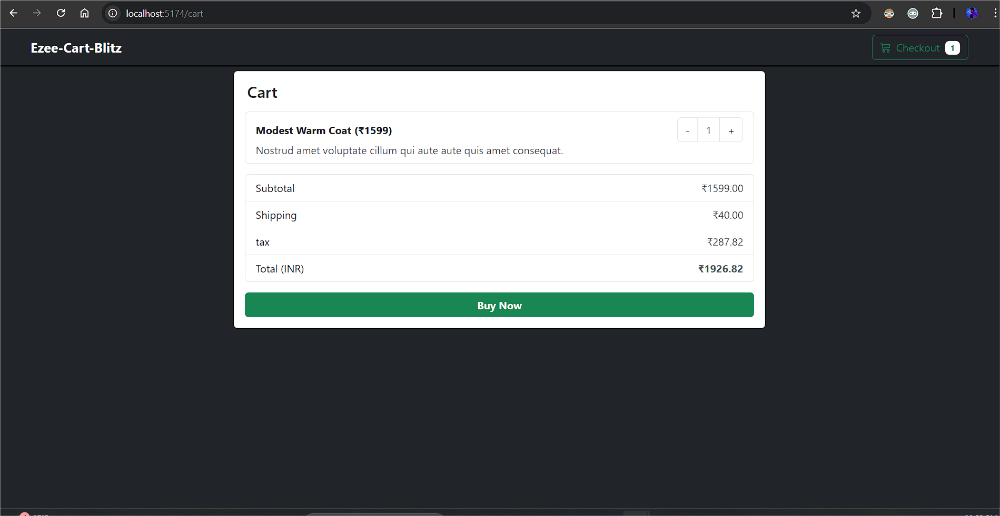
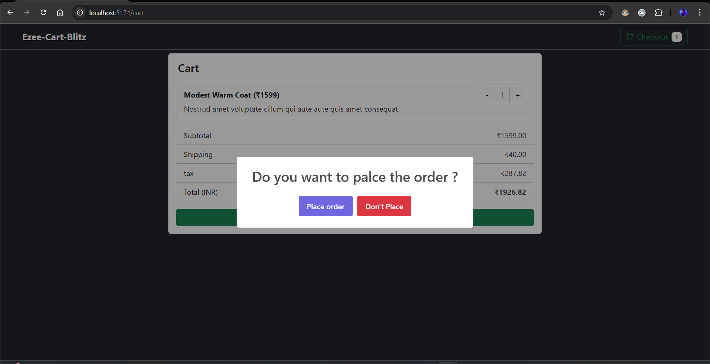

# Redux E-Commerce App

## 📌 Project Overview

This is a simple e-commerce web application built using **React and Redux** for state management. The project provides a seamless shopping experience with features like product listing, filtering, search functionality, adding items to the cart, and viewing related products. **Bootstrap** is used for styling to ensure a responsive and visually appealing UI.

## 🚀 Features

- 🔍 **Search Functionality** - Users can search for products dynamically.
- 🛒 **Add to Cart** - Users can add products to the shopping cart.
- 📄 **Product Details Page** - View detailed information about each product.
- 🔢 **Filter Functionality** - Filter products based on different categories.
- 🔄 **Related Products** - Show related products based on user selection.
- 🎨 **Bootstrap Styling** - Provides a clean and responsive UI.

## 🛠️ Technologies Used

- **Vite** - Fast build tool for modern web applications.
- **React** - Frontend framework for building UI components.
- **Redux** - State management library for handling global state.
- **Bootstrap** - CSS framework for responsive design.
- **JavaScript (ES6+)** - Used for scripting and logic implementation.

## 📂 Project Setup

### 1️⃣ Clone the Repository

```sh
git clone https://github.com/chaitanyakende25/Ezee-Blitz-App-Ecommerce-Web.git
cd redux-ecommerce-app
```

### 2️⃣ Install Dependencies

```sh
npm install
```

### 3️⃣ Run the Application

```sh
npm run dev
```

The app will run on `http://localhost:5173/` (default Vite port).

## 📸 Screenshots






